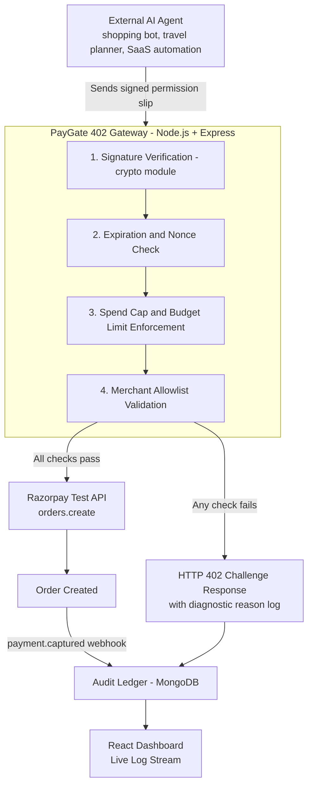

# PayGate 402 — System Architecture

**Protocol**: AP2 / x402  
**Track**: Razorpay AI Buildathon — Track 1: AI Growth & Agentic Commerce

---

## High-Level Data Flow

---

## Tech Stack & Rationale

| Layer | Technology | Why Chosen |
|---|---|---|
| **Gateway API** | Node.js + Express | Native non-blocking I/O for lightweight authorization handling; direct integration with Razorpay Node SDK. |
| **Signature Verification** | Node.js `crypto` module | Built-in, zero-dependency cryptographic verification for signed permission slips. |
| **Database / Audit Ledger** | MongoDB | Document store ideal for storing permission slips, mandate hashes, and Razorpay payment IDs. |
| **Dashboard** | React | Real-time governance UI displaying live authorization attempts and gate decisions. |
| **Payments Integration** | Razorpay Test Mode + Official Node SDK | Seamless order creation upon gate opening. |
| **Webhooks** | `payment.captured` | Asynchronous confirmation to log completed transactions in the audit ledger. |

---

## Razorpay APIs Used

- `orders.create`: Creates payment orders after permission slip passes signature, spend cap, and allowlist checks.
- `orders.fetch`: Retrieves and verifies order status.
- Webhook (`payment.captured`): Confirms successful capture and binds payment ID to mandate hash.

---

## Security & Governance Guardrails (Track 1 Requirements)

1. **Explainable**: Every decision logs an explicit audit trail (e.g. *"Signature valid. Cap ₹300. Order ₹250. Merchant allowed. PASSED."*).
2. **Bounded**: The spend cap inside the signed permission slip is strictly enforced. No spending over the limit is permitted.
3. **Gated**: Zero transactions occur without a verified digital signature.
4. **Audit Trail**: Mandate hashes are linked to Razorpay payment IDs in MongoDB.
5. **Graceful Failures**: Invalid/expired signatures or over-budget orders trigger an HTTP 402 response with diagnostic feedback.
