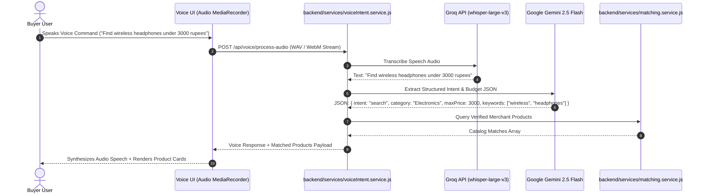

# 04. Voice Commerce & Multi-Round Negotiation Engine

## Overview

PayGate 402 integrates a multimodal speech-to-commerce pipeline alongside an autonomous multi-round price negotiation engine. This enables natural hands-free voice shopping while strictly respecting merchant profit margins and discount floors.

---

## Voice AI Architecture

---

## Multi-Round Autonomous Price Negotiation

When an AI buyer agent initiates price negotiation:
1. **Initial Offer**: The agent proposes a discounted price based on buyer budget and market targets.
2. **Merchant Policy Evaluation**: The gateway checks the merchant's active `RULE_DISCOUNT_AUTO_03` rule:
   - **Auto-Accept Threshold**: Discounts within the auto-accept range (e.g. up to 10%) are accepted immediately in round 1.
   - **Counter-Offer Range**: Discounts between 10% and 25% trigger a calculated counter-offer based on inventory velocity and margin floors.
   - **Hard Floor Rejection**: Offers demanding more than the merchant's maximum discount ceiling (e.g. 25%) are rejected.
3. **Mandate Creation**: Upon mutual agreement, the agreed amount is locked into the immutable Cart Mandate payload for cryptographic signing.
