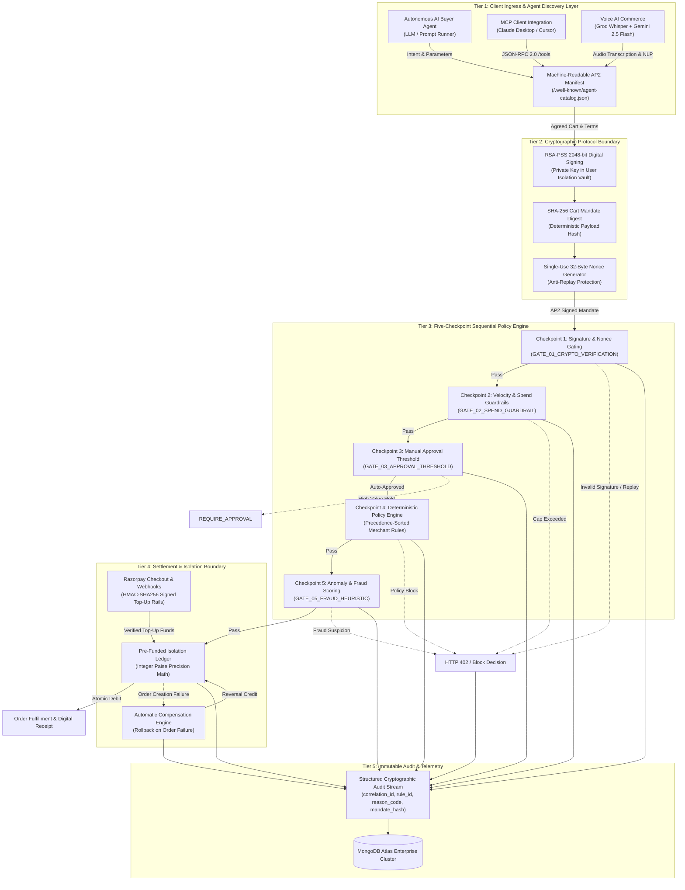

# PayGate 402 — System Architecture Specification

Welcome to the comprehensive technical architecture specification for the **AP2/x402 Agentic Settlement Gateway**. This directory contains exhaustive documentation of every subsystem, security boundary, protocol translation, and data flow.

---

## Architecture Navigation & Deep Dives

| Document | Subsystem / Focus | Core Invariants & Topics |
|---|---|---|
| **[01. Sequential Pipeline](01-SEQUENTIAL-PIPELINE.md)** | 5-Checkpoint Settlement Pipeline | Gate 1–5 execution order, deterministic precedence, HTTP 402 exit paths, auto-rollback. |
| **[02. Security & Cryptography](02-SECURITY-AND-CRYPTOGRAPHY.md)** | Trust Boundaries & Cryptographic Mesh | RSA-PSS 2048-bit mandates, SHA-256 hashing, 32-byte anti-replay nonces, AES-256 vault, integer paise math. |
| **[03. MCP Protocol Bridge](03-MCP-PROTOCOL-BRIDGE.md)** | Model Context Protocol Layer | JSON-RPC 2.0 stdio/HTTP server, tool schemas (`sign_cart_mandate`, `execute_settlement`, `discover_catalog`). |
| **[04. Voice & AI Commerce](04-VOICE-AND-AI-COMMERCE.md)** | Multimodal Ingress & Negotiation | Groq Whisper (`whisper-large-v3`), Gemini 2.5 Flash intent parsing, multi-round negotiation engine. |
| **[05. Data & Telemetry](05-DATA-AND-TELEMETRY.md)** | Ledger Integrity & Audit Stream | Double-entry isolation ledger model, correlation tracking, immutable audit log schemas. |

---

## High-Level System Topology

---

## Core System Invariants

1. **Zero Raw Credential Exposure**: AI agents never receive API keys, card numbers, or UPI PINs. All authorization flows via RSA-PSS signed Cart Mandates.
2. **Fail-Closed Gate Execution**: If any checkpoint in the 5-stage pipeline fails or encounters network degradation, the pipeline immediately halts with a structured HTTP 402 challenge.
3. **Atomic Automatic Compensation**: If an order creation or fulfillment step fails after a wallet debit, a compensation credit (`rollback_{contractId}`) reverses the debit automatically.
4. **Deterministic Arithmetic**: All internal financial operations execute using integer paise integers, strictly preventing floating-point rounding drift.
5. **Complete Auditability**: Every gate evaluation and money action emits a structured audit record containing `correlationId`, `ruleId`, `reasonCode`, and `mandateHash`.
