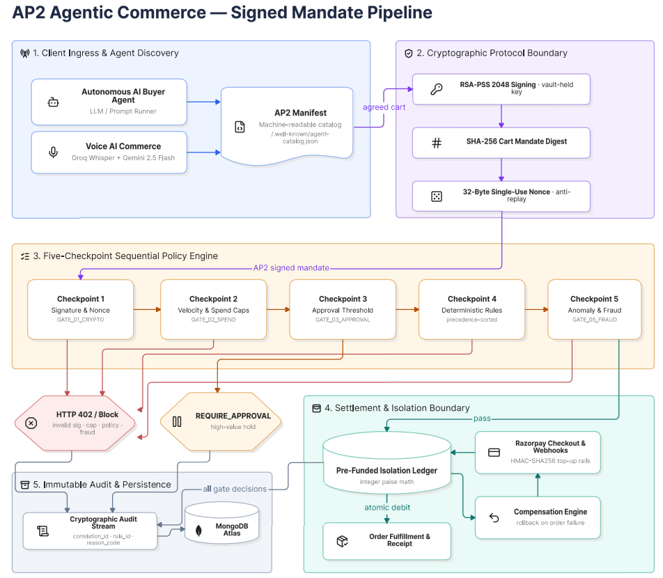

# AP2/x402 Agentic Settlement Gateway

<p align="center">
  <a href="https://pay-gate-402.vercel.app/" target="_blank">
    
  </a>
  <a href="https://drive.google.com/file/d/1kz6T__kCQHHva6TekyXSXjxkgxvBgTA2/view?usp=sharing" target="_blank">
    
  </a>
  
  
  
  
  
  
  
  
  
</p>

<p align="center">
  🌐 <b>Live Deployment:</b> <a href="https://pay-gate-402.vercel.app/" target="_blank"><b>https://pay-gate-402.vercel.app/</b></a> &nbsp;&nbsp;|&nbsp;&nbsp; 📄 <b>System Architecture Report:</b> <a href="https://drive.google.com/file/d/1kz6T__kCQHHva6TekyXSXjxkgxvBgTA2/view?usp=sharing" target="_blank"><b>Google Drive PDF Document</b></a>
</p>

---

> **"As autonomous AI agents evolve from conversational assistants into transactional buyers, payment infrastructure must transition from interactive human OTPs to cryptographically verifiable, policy-bounded machine settlement."**

---

## Problem & Technical Motivation

In digital commerce, cart abandonment remains a persistent challenge (averaging ~70% globally according to Baymard Institute research), driven by checkout friction, pricing uncertainty, and multi-step payment flows. As autonomous AI shopping agents (voice assistants, intent-driven bots) emerge to assist consumers, merchants face a fundamental architectural challenge:

1. **Unbounded Agent Risk**: Giving an autonomous agent direct access to merchant payment APIs or credit cards introduces catastrophic vulnerabilities — prompt injection, runaway model loops, and hallucinated transaction amounts.
2. **Missing Protocol Bridge**: Open agent protocols (like Google's AP2 and Anthropic's Model Context Protocol) need a secure gateway to interface with standard domestic payment rails and merchant product catalogs.
3. **Margin Protection**: Merchants need deterministic, automated discount ceilings and category rules so agents can negotiate within approved business boundaries without human intervention.

**PayGate 402 provides an Agentic Payment Integrity Mesh** that bridges merchant catalogs to autonomous agents via standard AP2 and Safe MCP interfaces, enforcing a strict 5-checkpoint verification engine and cryptographic mandate signatures before any money moves.

## Core Features

- **Safe Model Context Protocol (MCP) Gateway** — standard JSON-RPC 2.0 interface (`/api/mcp` and `mcp-server.js`) allowing external AI agents (Claude Desktop, Cursor, shopping bots) to query catalogs and policy discount bounds, and pipe mandates directly into verification gates.
- **TypeScript Type Contracts & Strict Zod Validation** — formal `.d.ts` interfaces and `.strict()` runtime schemas on all financial endpoints to prevent floating-point drift and reject rogue payload injections.
- **AP2 Cryptographic Cart Mandates** — 2048-bit RSA client-side signing using RSA-PSS padding and SHA-256 hashes, ensuring non-repudiation before settlement.
- **Atomic Nonce Anti-Replay Engine** — single-use cryptographic nonces with atomic database locking to prevent duplicate contract minting and race conditions.
- **Five-Checkpoint Verification Pipeline** — sequential evaluation of signature integrity, spend velocity caps, manual approval thresholds, merchant policy rules, and fraud risk scoring.
- **Immutable Explainable Audit Trail** — every gate decision (`ALLOW`, `BLOCK`, `REQUIRE_APPROVAL`, `PAYOUT_HOLD`) logs correlation IDs, rule IDs, and reason codes for full auditability.
- **Automated Ledger Rollback** — if downstream order fulfillment fails after a wallet debit, automated credit reversals are executed with dedicated rollback audit events.
- **Machine-Readable Agent Discovery** — automated `.well-known/agent-catalog.json` manifests enabling autonomous agents to discover products and terms programmatically.
- **HTTP 402 Machine-Readable Error Signals** — structured payment challenges and policy violation codes returned upon rule rejections.

## Architecture



## Architectural Comparison

| Dimension | Traditional Web API | Unbounded LLM Agent Scripting | PayGate 402 (AP2/MCP Mesh) |
| :--- | :--- | :--- | :--- |
| **Agent Authentication** | Static API Keys / Bearer Tokens | Injected browser credentials | **Client-side RSA-PSS 2048 Signed Mandates** |
| **Replay Protection** | Idempotency keys (optional) | None (vulnerable to looping) | **Single-use cryptographic nonces with atomic DB lock** |
| **Spend Boundaries** | Post-transaction card limits | Unbounded LLM spend risk | **Pre-settlement velocity & per-transaction wallet caps** |
| **Discount Negotiation** | Static coupon codes | Hallucination / prompt injection risk | **Deterministic policy-bounded negotiation ceilings** |
| **Decision Explainability** | Generic HTTP 400/500 errors | Non-deterministic logs | **Per-checkpoint audit trail with rule IDs & reason codes** |
| **External Agent Standard** | Custom bespoke REST endpoints | Unstructured HTML scraping | **Standard Model Context Protocol (MCP) & AP2 JSON-RPC** |

## Full Feature Inventory

### Buyer / User

| Feature | Description |
|---|---|
| Authentication & Roles | Email/password auth with role-based access (buyer, merchant, admin). |
| Smart Catalog Discovery | Search and browse merchant catalogs with live product data. |
| Voice AI Assistant | Real speech-to-text (Groq Whisper) and intent extraction (Gemini 2.5 Flash) for hands-free shopping. |
| Pre-Funded Agent Wallet | Capped wallet with per-transaction and daily velocity limits, topped up via real Razorpay Checkout. |
| Wishlist & Price Drops | Track products and get notified of price changes. |
| Order Tracking | Full order lifecycle and fulfillment status. |
| Spending Analytics | Personal transaction history and spend breakdowns. |
| Scheduled Tasks | Cron-driven recurring agent purchase tasks. |

### Merchant

| Feature | Description |
|---|---|
| Self-Serve Onboarding | Business registration with PAN/GSTIN and Razorpay key setup — no manual approval gate. |
| Catalog Management | Product CRUD, image uploads, and bulk CSV import. |
| Policy Builder | Merchant-owned spend caps, category rules, approval thresholds, and negotiation discount thresholds with deterministic precedence. |
| Live Orders & Fulfillment | Order feed with shipping/fulfillment status updates. |
| AI Co-Pilot | Applies real pricing, restock, and policy-cap adjustments based on live analytics. |
| Campaign Orchestrator | Merchant-defined promotional discounts for AI-agent bulk orders, factored directly into live negotiations. |
| Agent-Readable Manifest | Auto-published catalog and policy JSON files (`/.well-known/agent-catalog.json`) for AI agent discovery. |

### AI Agent & Negotiation Pipeline

| Feature | Description |
|---|---|
| Structured Intent Submission | Agent states desired item, category, and budget cap. |
| Catalog Matching | System matches intent against live merchant inventory. |
| Multi-Round Negotiation | Agent and merchant policy engine exchange offers/counters until acceptance or rejection. |
| AP2 Mandate Signing | RSA-PSS 2048-bit signed Cart Mandate with nonce-based replay protection. |
| Five-Checkpoint Settlement | Signature check plus four policy/fraud gates before funds move. |
| Order Status Tracking | Post-settlement order and fulfillment visibility for the agent. |

### Admin & Security Mesh

| Feature | Description |
|---|---|
| Platform Telemetry | GMV and platform-wide transaction overview. |
| Audit Log Monitoring | Live feed of every gate decision across the platform with rule IDs and reason codes. |
| Merchant Compliance Scores | Health/compliance signals per merchant. |
| System Diagnostics | Infrastructure and integration health checks. |
| Security Parameter Control | Global configuration of gate thresholds and limits. |

## Application Previews

### Desktop Views

| User Catalog | Merchant Catalog |
| :---: | :---: |
|  |  |
| **Wallet Management** | **Adding Funds (Razorpay)** |
|  |  |

### Mobile Responsive Views

| User Catalog | Wallet Top-Up | Order Tracking |
| :---: | :---: | :---: |
|  |  |  |

## Technology Stack

| Layer | Technology |
|---|---|
| Backend | Node.js, Express, MongoDB (Mongoose) |
| Agent Protocol | Google AP2, Coinbase x402 |
| Cryptography | Node.js native `crypto` — RSA-2048, RSA-PSS, SHA-256, AES-256-GCM |
| Payments | Razorpay test-mode APIs (Checkout, Orders), HMAC-SHA256 webhook verification |
| Voice AI | Groq-hosted Whisper (`whisper-large-v3`), Gemini 2.5 Flash |
| Frontend | React, React Router, Vite, Tailwind |
| Media | Cloudinary (product images, merchant logos) |

## Setup Guide

### Prerequisites

- Node.js 18+
- A MongoDB connection string (Atlas or local)
- A Razorpay test-mode account (Key ID + Key Secret)
- (Optional) Groq API key for Voice AI transcription, Gemini API key for intent parsing, Cloudinary credentials for image uploads

### Backend

```bash
cd backend
npm install
npm test          # Run automated unit/integration test suite (22 tests)
npm run seed      # One-command demo database seeder
```

Create a `.env` file in `backend/` with:

```env
PORT=4000
NODE_ENV=development
CLIENT_URL=http://localhost:5173
MONGODB_URI=your_mongodb_connection_string

RAZORPAY_KEY_ID=your_razorpay_key_id
RAZORPAY_KEY_SECRET=your_razorpay_key_secret
RAZORPAY_WEBHOOK_SECRET=your_razorpay_webhook_secret

ENCRYPTION_SECRET=a_32_byte_secret_for_aes_256_gcm

# Optional — Voice AI
GROQ_API_KEY=your_groq_api_key
GEMINI_API_KEY=your_gemini_api_key

# Optional — Image uploads
CLOUDINARY_CLOUD_NAME=your_cloud_name
CLOUDINARY_API_KEY=your_cloudinary_key
CLOUDINARY_API_SECRET=your_cloudinary_secret

# Optional — seeds an admin account on first run
ADMIN_EMAIL=admin@example.com
ADMIN_PASSWORD=choose_a_strong_password
```

Run it:

```bash
npm run dev     # nodemon, auto-restart
# or
npm start       # plain node
```

The API will be available at `http://localhost:4000/api`.

### Frontend

```bash
cd frontend
npm install
```

Create a `.env` file in `frontend/` with:

```env
VITE_API_BASE_URL=http://localhost:4000/api
```

Run it:

```bash
npm run dev
```

The app will be available at the local URL Vite prints (typically `http://localhost:5173`).

## Concurrency & Verification Suite

PayGate 402 includes an automated test suite verifying mathematical precision, anti-replay nonce locking, cryptographic signature verification, spend velocity guardrails, and MCP tool execution.

### Reproduction Command
```bash
cd backend
npm test
```

### Empirical Measured Results

| Test Suite | Scenario Tested | Concurrency Level | Outcome & Measured Result | Security & Integrity Guarantee |
| :--- | :--- | :--- | :--- | :--- |
| **Wallet Concurrency** (`walletConcurrency.test.js`) | 10 parallel ₹150 debits on ₹1,000 balance | 10 simultaneous async workers | **6 Succeeded, 4 Rejected** | Exact ₹100 final balance, zero drift, overdraft prevented |
| **Nonce Anti-Replay** (`contractConcurrency.test.js`) | 10 parallel contract generations on same intent | 10 simultaneous async calls | **1 Minted, 9 Replay Blocked** | Atomic DB lock ensures zero duplicate contracts |
| **RSA-PSS Integrity** (`mandateCrypto.test.js`) | Cart mandate payload tampering / bad key | Synchronous verification | **100% Tamper Detection** | Cryptographic signature rejection before settlement |
| **Settlement Precision** (`settlementAndRollback.test.js`) | 100 successive micro-credits & debits | 100 operations | **₹1,000.00 Exact Final Balance** | Integer paise arithmetic eliminates floating-point drift |
| **Policy Gating** (`policyGates.test.js`) | Spend cap & category violations | Rule matrix evaluation | **Deterministic Gate Enforcement** | Blocked with HTTP 402 + rule ID & audit logs |
| **Safe MCP Gateway** (`mcp.test.js`) | `tools/list`, `discover_catalog`, rogue tools | JSON-RPC 2.0 requests | **Safe Bounded Responses** | Unsafe debit tools blocked with `-32601` error |

---

## Safe MCP Gateway Architecture

> **Design Principle**: Rather than exposing raw payment execution tools over MCP, PayGate 402 exposes an **MCP Gateway** that pipes requests directly into our 5-Checkpoint Verification Engine. External AI agents (Claude Desktop, Cursor, shopping bots) interact via standard MCP JSON-RPC 2.0, but can never bypass security gates or execute unverified ledger debits.

---

## Architecture & Security Boundaries

- **Agent Isolation Boundary**: Agent-triggered settlement debits an internal, pre-funded wallet ledger rather than creating a live Razorpay order per micro-transaction. This is an intentional security isolation boundary — the agent is never exposed to raw payment credentials directly — while top-ups use live Razorpay Checkout rails.
- **Tagged Ledger**: The internal wallet ledger operates as an atomic transaction ledger recording source and destination accounts (`debitAccount`/`creditAccount`) per entry with optimistic locking.

---

Built for the Razorpay AI Buildathon 2026 — Track 1: AI Growth & Agentic Commerce.

