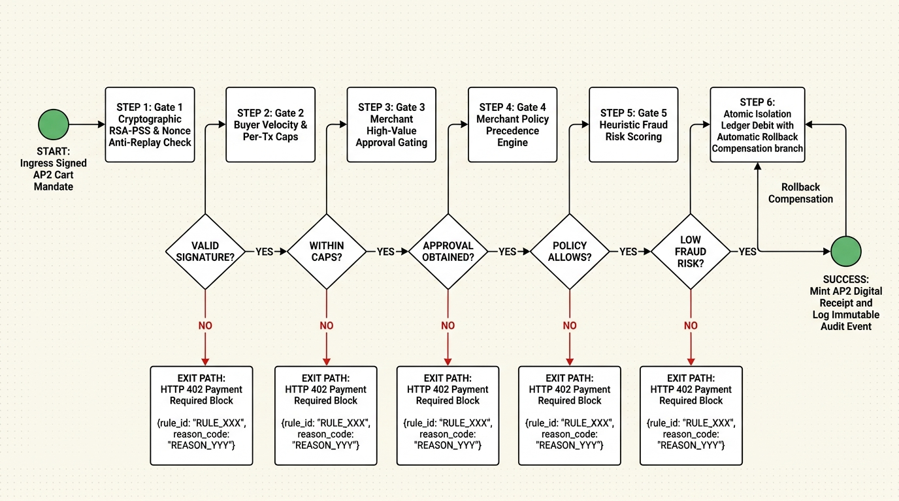
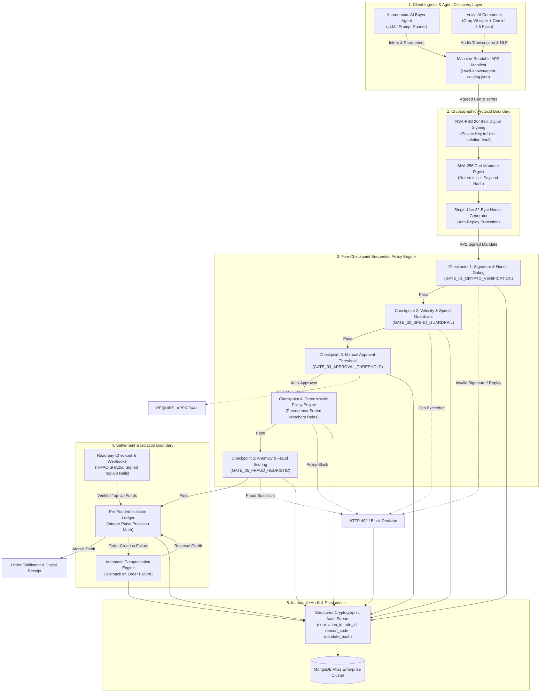
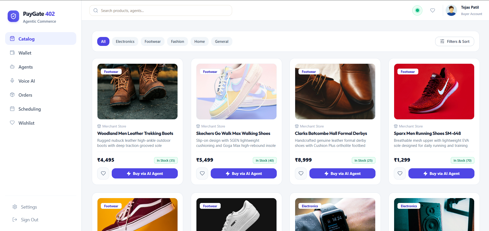
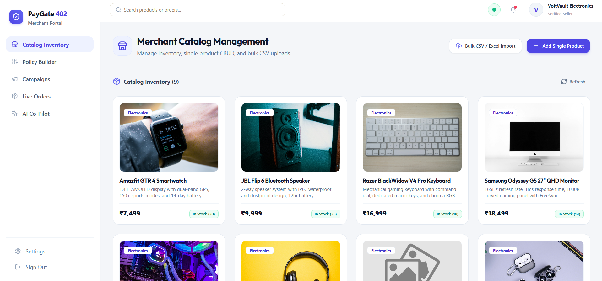
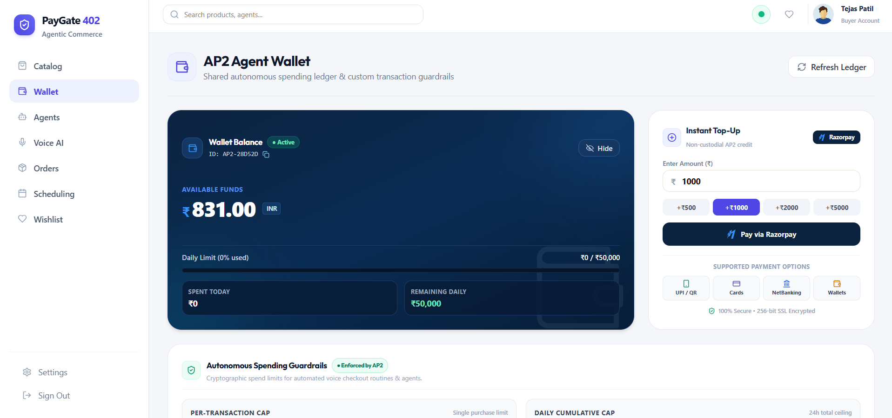
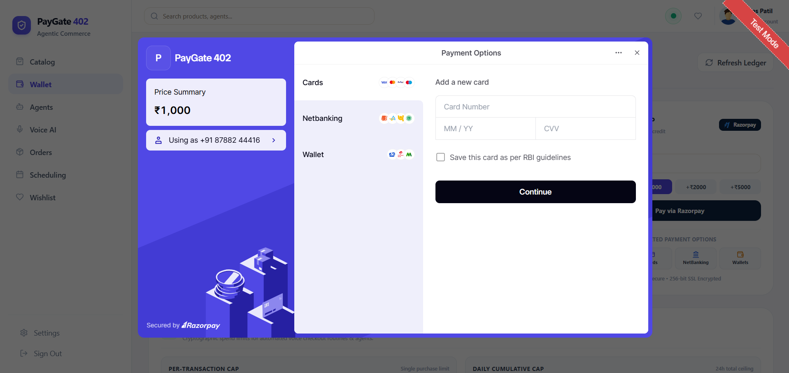
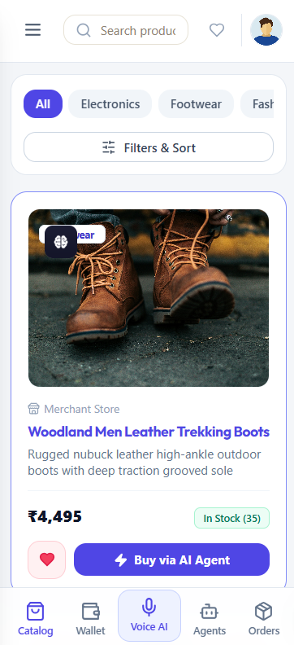
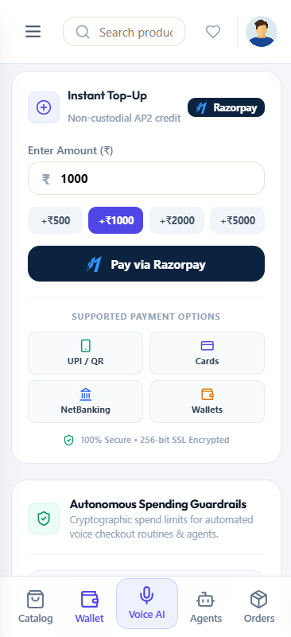
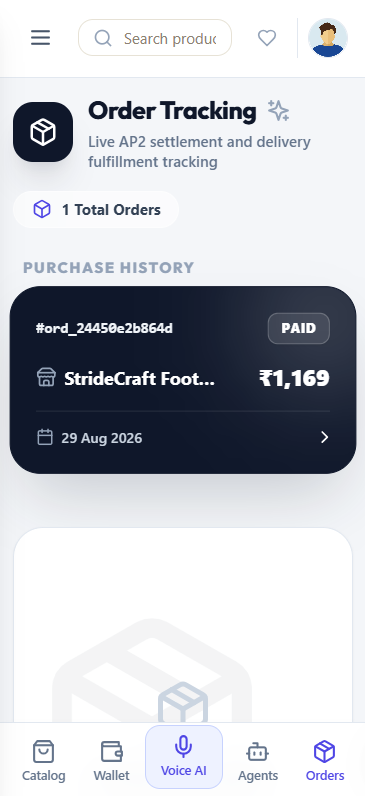

# AP2/x402 Agentic Settlement Gateway

<p align="center">
  <a href="https://pay-gate-402.vercel.app/" target="_blank">
    
  </a>
  
  
  
  
  
  
  
  
</p>

<p align="center">
  🌐 <b>Live Deployment:</b> <a href="https://pay-gate-402.vercel.app/"><b>https://pay-gate-402.vercel.app/</b></a>
</p>

---

> **"Razorpay and NPCI proved AI agents can pay autonomously — for seven curated companies, on one closed rail. PayGate 402 is the self-serve, open-protocol version any of Razorpay's other merchants can turn on today."**

---

## Introduction

The **AP2/x402 Agentic Settlement Gateway** is a policy-gated middleware layer that lets autonomous AI buyer agents transact safely on merchant catalogs without ever touching raw API keys or violating cardholder authorization requirements.

Autonomous agents cannot be handed unrestricted merchant credentials — doing so exposes merchants to prompt-injection risk, unbounded spend, and non-deterministic model behavior. At the same time, global agentic commerce protocols such as Google's **AP2 (Agent Payments Protocol)** and Coinbase's **x402** convention have no bridge into India's domestic payment rails.

This gateway closes that gap. An AI agent discovers a merchant's catalog, negotiates a price, and signs a cryptographic mandate for the purchase. That mandate must pass a five-checkpoint security pipeline before a pre-funded, capped wallet is debited — with every decision, pass or fail, written to an immutable audit log.

## Core Features

- **AP2 Signed Cart Mandates** — every purchase intent is signed with a 2048-bit RSA key using RSA-PSS padding and a SHA-256 hash, before any money moves.
- **Nonce-Based Replay Protection** — every mandate carries a single-use nonce; a captured or resubmitted request is rejected outright.
- **Five-Checkpoint Settlement Engine** — signature/nonce verification, spend-velocity guardrails, manual-approval gating, merchant policy pre-check, and fraud risk scoring, evaluated in strict sequence. Any single failure halts the transaction immediately.
- **Full Audit Trail** — every checkpoint decision (`ALLOW` / `BLOCK` / `REQUIRE_APPROVAL` / `PAYOUT_HOLD`) is logged with a correlation ID, rule ID, reason code, and mandate hash — satisfying the buildathon's explicit bar of "every money action explainable, bounded and gated."
- **Automatic Rollback on Failure** — if a transaction fails after the wallet has already been debited, the wallet is credited back automatically and the reversal is logged as its own audit event. No manual reconciliation required.
- **Self-Serve, Open-Protocol Onboarding** — any merchant can register and go live independently; every merchant is automatically exposed via a machine-readable catalog and policy manifest that any AP2-compatible AI agent can read without custom integration work.
- **HTTP 402 Policy-Violation Signal** — a blocked transaction returns a structured `402 Payment Required` response with a machine-readable challenge object, logged to the audit trail.

## Architecture

### Sequential Authorization Pipeline

Every agent-initiated transaction passes through this pipeline, in order, before a rupee moves:



### High-Level System Architecture & Security Mesh



## Competitive Positioning

|  | Razorpay + NPCI (Reserve Pay) | PayGate 402 |
|---|---|---|
| **Onboarding** | Curated — a small number of named enterprise brands | Self-serve — any merchant, today |
| **Rail** | UPI only, proprietary NPCI infrastructure | Protocol-based (AP2/x402), rail-agnostic |
| **Authorization** | A single flat spending limit set once | Signed mandate verified through five checkpoints |
| **Audit Trail** | Not exposed publicly | Full per-decision audit trail with rule IDs & reason codes |
| **Availability** | Live, closed | Live, open — no regulatory approval required |

## Full Feature Inventory

### Buyer / User

| Feature | Description |
|---|---|
| Authentication & Roles | Email/password auth with role-based access (buyer, merchant, admin). |
| Smart Catalog Discovery | Search and browse merchant catalogs with live product data. |
| Voice AI Assistant | Real speech-to-text (Groq Whisper) and intent extraction (Gemini 2.5 Flash) for hands-free shopping. |
| Pre-Funded Agent Wallet | Capped wallet with per-transaction and daily velocity limits, topped up via real Razorpay Checkout. |
| Wishlist & Price Drops | Track products and get notified of price changes. |
| Order Tracking | Full order lifecycle and fulfillment status. |
| Spending Analytics | Personal transaction history and spend breakdowns. |
| Scheduled Tasks | Cron-driven recurring agent purchase tasks. |

### Merchant

| Feature | Description |
|---|---|
| Self-Serve Onboarding | Business registration with PAN/GSTIN and Razorpay key setup — no manual approval gate. |
| Catalog Management | Product CRUD, image uploads, and bulk CSV import. |
| Policy Builder | Merchant-owned spend caps, category rules, approval thresholds, and negotiation discount thresholds with deterministic precedence. |
| Live Orders & Fulfillment | Order feed with shipping/fulfillment status updates. |
| AI Co-Pilot | Applies real pricing, restock, and policy-cap adjustments based on live analytics. |
| Campaign Orchestrator | Merchant-defined promotional discounts for AI-agent bulk orders, factored directly into live negotiations. |
| Agent-Readable Manifest | Auto-published catalog and policy JSON files (`/.well-known/agent-catalog.json`) for AI agent discovery. |

### AI Agent & Negotiation Pipeline

| Feature | Description |
|---|---|
| Structured Intent Submission | Agent states desired item, category, and budget cap. |
| Catalog Matching | System matches intent against live merchant inventory. |
| Multi-Round Negotiation | Agent and merchant policy engine exchange offers/counters until acceptance or rejection. |
| AP2 Mandate Signing | RSA-PSS 2048-bit signed Cart Mandate with nonce-based replay protection. |
| Five-Checkpoint Settlement | Signature check plus four policy/fraud gates before funds move. |
| Order Status Tracking | Post-settlement order and fulfillment visibility for the agent. |

### Admin & Security Mesh

| Feature | Description |
|---|---|
| Platform Telemetry | GMV and platform-wide transaction overview. |
| Audit Log Monitoring | Live feed of every gate decision across the platform with rule IDs and reason codes. |
| Merchant Compliance Scores | Health/compliance signals per merchant. |
| System Diagnostics | Infrastructure and integration health checks. |
| Security Parameter Control | Global configuration of gate thresholds and limits. |

## Application Previews

### Desktop Views

| User Catalog | Merchant Catalog |
| :---: | :---: |
|  |  |
| **Wallet Management** | **Adding Funds (Razorpay)** |
|  |  |

### Mobile Responsive Views

| User Catalog | Wallet Top-Up | Order Tracking |
| :---: | :---: | :---: |
|  |  |  |

## Technology Stack

| Layer | Technology |
|---|---|
| Backend | Node.js, Express, MongoDB (Mongoose) |
| Agent Protocol | Google AP2, Coinbase x402 |
| Cryptography | Node.js native `crypto` — RSA-2048, RSA-PSS, SHA-256, AES-256-GCM |
| Payments | Razorpay test-mode APIs (Checkout, Orders), HMAC-SHA256 webhook verification |
| Voice AI | Groq-hosted Whisper (`whisper-large-v3`), Gemini 2.5 Flash |
| Frontend | React, React Router, Vite, Tailwind |
| Media | Cloudinary (product images, merchant logos) |

## Setup Guide

### Prerequisites

- Node.js 18+
- A MongoDB connection string (Atlas or local)
- A Razorpay test-mode account (Key ID + Key Secret)
- (Optional) Groq API key for Voice AI transcription, Gemini API key for intent parsing, Cloudinary credentials for image uploads

### Backend

```bash
cd backend
npm install
npm test          # Run automated unit/integration test suite (22 tests)
npm run seed      # One-command demo database seeder
```

Create a `.env` file in `backend/` with:

```env
PORT=4000
NODE_ENV=development
CLIENT_URL=http://localhost:5173
MONGODB_URI=your_mongodb_connection_string

RAZORPAY_KEY_ID=your_razorpay_key_id
RAZORPAY_KEY_SECRET=your_razorpay_key_secret
RAZORPAY_WEBHOOK_SECRET=your_razorpay_webhook_secret

ENCRYPTION_SECRET=a_32_byte_secret_for_aes_256_gcm

# Optional — Voice AI
GROQ_API_KEY=your_groq_api_key
GEMINI_API_KEY=your_gemini_api_key

# Optional — Image uploads
CLOUDINARY_CLOUD_NAME=your_cloud_name
CLOUDINARY_API_KEY=your_cloudinary_key
CLOUDINARY_API_SECRET=your_cloudinary_secret

# Optional — seeds an admin account on first run
ADMIN_EMAIL=admin@example.com
ADMIN_PASSWORD=choose_a_strong_password
```

Run it:

```bash
npm run dev     # nodemon, auto-restart
# or
npm start       # plain node
```

The API will be available at `http://localhost:4000/api`.

### Frontend

```bash
cd frontend
npm install
```

Create a `.env` file in `frontend/` with:

```env
VITE_API_BASE_URL=http://localhost:4000/api
```

Run it:

```bash
npm run dev
```

The app will be available at the local URL Vite prints (typically `http://localhost:5173`).

## Known Limitations — Stated Honestly

- An earlier build included an experimental MCP (Model Context Protocol) tool layer. It was removed before submission after an internal review found its settlement path bypassed the velocity, approval, and fraud checkpoints that gate every other transaction in this system — shipping it in that state would have contradicted our own security claims. Re-adding it correctly (routed through the same five-checkpoint pipeline, with proper caller authorization) is scoped as follow-up work, not a requirement for this track.
- Agent-triggered settlement debits an internal, pre-funded wallet ledger rather than creating a live Razorpay order per micro-transaction. This is an intentional security isolation boundary — the agent is never exposed to raw payment credentials directly — while top-ups use live Razorpay Checkout rails.
- The internal wallet ledger operates as a tagged transaction ledger recording source and destination accounts (`debitAccount`/`creditAccount`) per entry; it is not a full double-entry accounting system (current balance is maintained as an atomically updated field rather than dynamically derived from ledger sums).

---

Built for the Razorpay AI Buildathon 2026 — Track 1: AI Growth & Agentic Commerce.

