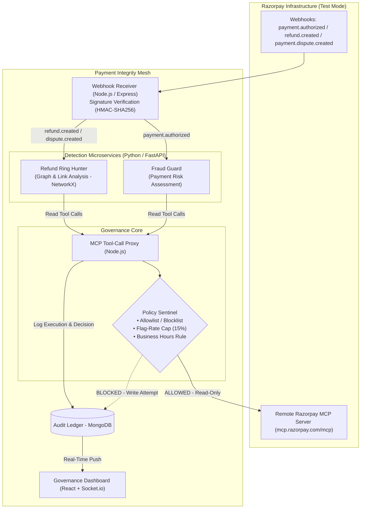

# Payment Integrity Mesh

<p align="center">
  
  
  
  
  
  
</p>

<p align="center">
  <b>Defense-only, proxy-enforced fraud and refund-ring detection for Razorpay merchants.</b><br/>
  Built for the <b>Razorpay AI Buildathon — Track 2: AI Risk Manager</b>
</p>

---

## Executive Summary

Small and medium Razorpay merchants often lack access to expensive enterprise fraud intelligence platforms like Stripe Radar or Ravelin. As merchants deploy autonomous AI agents to manage customer support, refunds, and payment disputes, they face a security risk: uncontrolled write actions (such as automatic refunds or payment captures) triggered by misconfigured or hallucinating agents.

**Payment Integrity Mesh** is a governance and risk management layer built on top of Razorpay's Model Context Protocol (MCP) server. It sits between AI detection agents and Razorpay's API infrastructure to enforce structural defense-only behavior, detect refund & dispute rings, and maintain an audit ledger.

---

## Key Features

- **MCP Tool-Call Proxy & Policy Sentinel (Node.js / Express)**
  - Intercepts every tool call before network dispatch.
  - Blocks write-capable API operations (`create_refund`, `capture_payment`) at the proxy level.
  - Enforces operational safety rules: rolling 24h 15% flag-rate caps and business-hours queueing rules (9 AM – 9 PM IST).

- **Dual AI Detection Microservices (Python / FastAPI)**
  - **Fraud Guard**: Evaluates transaction risk upon `payment.authorized` webhooks using payment and card metadata.
  - **Refund Ring Hunter**: Uses `networkx` graph analysis to identify coordinated refund rings sharing card BINs, contact details, or tight temporal clusters.

- **Immutable Audit Ledger (MongoDB)**
  - Records every proxy decision (`ALLOW` / `BLOCK`), policy violation, risk score, correlation ID, and execution trace.

- **Real-Time Governance Dashboard (React + Socket.io)**
  - Live feed of incoming Razorpay webhooks.
  - Live stream of proxy decisions and blocked tool calls.
  - Interactive "Simulate Attack" demo button to test write-blocking in real time.
  - Evaluation panel displaying empirical detection accuracy metrics.

---

## System Architecture



---

## Policy Sentinel & MCP Tool Access Matrix

Every tool invocation requested by an AI agent must pass through the Policy Sentinel prior to execution.

### Allowed Read-Only Tools

| Tool Name | Scope | Purpose |
|---|---|---|
| `fetch_payment` | Read | Fetch payment entity details and status |
| `fetch_payment_card_details` | Read | Extract card BIN, network, and issuer context |
| `fetch_order_payments` | Read | Retrieve payment history associated with an order |
| `fetch_all_refunds` | Read | Query historical refund records for pattern mining |
| `fetch_multiple_refunds_for_payment` | Read | Inspect refund attempts on specific payments |
| `fetch_specific_refund_for_payment` | Read | Audit granular refund metadata |

### Strictly Blocked Write Tools

| Tool Name | Action | Proxy Enforcement |
|---|---|---|
| `create_refund` | Write | **BLOCKED** — Throws `PolicyViolation` immediately |
| `capture_payment` | Write | **BLOCKED** — Throws `PolicyViolation` immediately |
| *All other write tools* | Write | **BLOCKED** — Deny-by-default policy |

---

## Repository Structure

```
.
├── ARCHITECTURE.md          # Detailed architecture & design decisions
├── IMPLEMENTATION_GUIDE.md  # 28-phase step-by-step implementation guide
├── README.md                # Project overview, tech stack & setup guide
├── backend/                 # Node.js backend: Webhook receiver, MCP Proxy, Policy Sentinel
├── agents/                  # Python FastAPI services: Fraud Guard & Refund Ring Hunter
├── frontend/                # React + Socket.io real-time governance dashboard
└── eval/                    # Benchmark harness & synthetic dataset generation scripts
```

---

## Quickstart & Local Setup

### Prerequisites

- **Node.js**: v18+ and `npm`
- **Python**: v3.10+ and `pip`
- **MongoDB**: Local instance or MongoDB Atlas connection string
- **Razorpay API Credentials**: Test-Mode `RAZORPAY_KEY_ID` and `RAZORPAY_KEY_SECRET`

### 1. Environment Setup

Create a `.env` file in `backend/`:

```env
PORT=5000
MONGODB_URI=mongodb://localhost:27017/payment_integrity_mesh
RAZORPAY_KEY_ID=your_test_key_id
RAZORPAY_KEY_SECRET=your_test_key_secret
RAZORPAY_WEBHOOK_SECRET=your_webhook_secret
AGENTS_URL=http://localhost:8000
```

### 2. Backend & MCP Proxy Server

```bash
cd backend
npm install
npm start
```

### 3. Python AI Detection Agents

```bash
cd agents
python -m venv venv
# Windows: venv\Scripts\activate | Unix: source venv/bin/activate
pip install -r requirements.txt
uvicorn main:app --reload --port 8000
```

### 4. Governance Dashboard

```bash
cd frontend
npm install
npm start
```

---

## Evaluation & Metrics

The project features an evaluation harness (`eval/run_evaluation.py`) tested against a labeled synthetic benchmark set of 100 transactions/refunds (~70 clean, ~30 abuse-pattern cases):

| Metric | Description | Target / Standard |
|---|---|---|
| **Precision** | Ratio of correctly flagged abuse cases to total flags | > 85% |
| **Recall** | Ratio of detected abuse cases to total actual abuse cases | > 80% |
| **False Positive Count** | Number of legitimate transactions incorrectly flagged | Tracked |
| **Est. FP Cost** | Calculated cost impact of false positives | Minimized |

*Note*: Benchmark evaluations are conducted against a synthetic, non-adversarial 100-item test set. Real-world fraud patterns and merchant dynamics will vary.

---

## What This Is Not

- **Not a replacement for Razorpay's native security**: Razorpay maintains robust enterprise fraud controls. Payment Integrity Mesh adds a merchant-configurable, auditable proxy layer specifically for agentic workflows.
- **Not a write-enabled autonomous agent**: The mesh enforces strict defense-only behavior; it will never execute financial actions autonomously.
- **Not a general-purpose fraud engine**: Explicitly targeted at refund abuse, dispute rings, and agent tool-call governance.

---

## Related Documentation

- [Architecture Specification](file:///d:/projects/razorpay/ARCHITECTURE.md)
- [Phase-by-Phase Implementation Guide](file:///d:/projects/razorpay/IMPLEMENTATION_GUIDE.md)

---

Built for the **Razorpay AI Buildathon**
