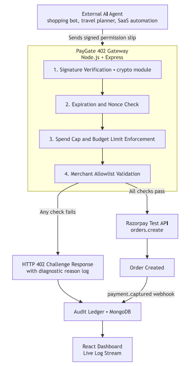

# AP2/x402 Agentic Settlement Gateway

  
  
  
  
  
  
  
  

---

## Introduction

The **AP2/x402 Agentic Settlement Gateway** is a policy-gated middleware layer that lets autonomous AI buyer agents transact safely on merchant catalogs without ever touching raw API keys or violating cardholder authorization requirements.

Autonomous agents cannot be handed unrestricted merchant credentials — doing so exposes merchants to prompt-injection risk, unbounded spend, and non-deterministic model behavior. At the same time, global agentic commerce protocols such as Google's **AP2 (Agent Payments Protocol)** and Coinbase's **x402** have no bridge into India's domestic payment rails.

This gateway closes that gap. It intercepts unauthenticated agent requests, issues an HTTP 402 challenge, verifies cryptographically signed AP2 Cart Mandates against per-agent spending policies, and — only after verification — executes a bounded settlement through the official **Razorpay MCP Server**, writing every transaction to an auditable double-entry ledger.

## Features

- **HTTP 402 Negotiation Engine** — intercepts agent purchase requests and responds with a structured payment challenge containing an AP2 Cart Mandate.
- **Cryptographic Mandate Verification** — validates ECDSA signatures on Intent, Cart, and Payment Mandates against registered agent public keys.
- **Policy-Gated Execution Proxy** — enforces per-transaction spend caps, velocity limits, and merchant whitelists before any funds move.
- **Razorpay MCP Settlement** — routes verified requests through `initiate_payment`, `capture_payment`, and order-management tools on the official Razorpay Remote MCP Server.
- **x402 Stablecoin Support** — accepts machine-to-machine micropayments over the x402 protocol as an alternative settlement path.
- **Idempotent Dual-Ledger Audit Trail** — maps every AP2 mandate ID to its resulting Razorpay payment ID (`pay_xxx`) in a non-repudiable, double-entry ledger.
- **Deterministic Failure Handling** — rejects unsigned, expired, over-budget, or replayed mandates before any Razorpay API call is made.

## System Flow

