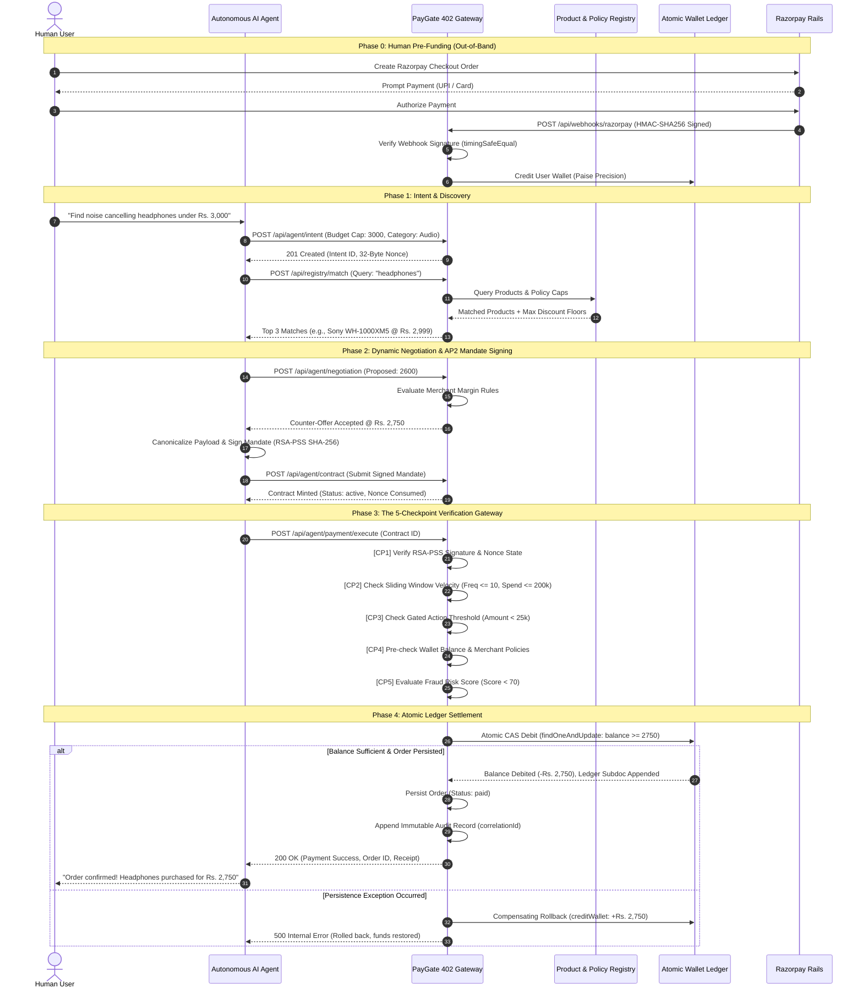

# PayGate 402 — System Architecture & Subsystem Specification

> **A Comprehensive Technical Breakdown of the AP2 / x402 Agentic Settlement Gateway**

---

## 1. Architectural Overview & Design Philosophy

**PayGate 402** is a specialized payment integrity mesh and settlement gateway engineered specifically for autonomous AI agents. Unlike human-driven checkouts that rely on visual confirmation, OTPs, and interactive 3DS redirects, PayGate 402 provides machine-to-machine financial execution governed by **cryptographic delegation, deterministic policy enforcement, multi-factor risk scoring, and atomic ledger settlement**.

### Core Design Principles:
1. **Zero Raw Credential Exposure:** Autonomous agents never receive direct access to credit card numbers, UPI PINs, bank accounts, or live Razorpay API secrets.
2. **Cryptographic Bounded Mandates:** Financial delegation is granted via tamper-evident AP2 Cart Mandates signed with asymmetric RSA-PSS keypairs and bounded by explicit spend ceilings.
3. **Sequential Verification Firewalls:** Every transaction must traverse a 5-Checkpoint Verification Gateway in strict order before any funds leave the user's pre-funded wallet.
4. **Paise-Integer Precision & CAS Concurrency:** All balance operations use integer paise arithmetic to eliminate floating-point drift, executed via atomic Compare-And-Swap (CAS) operations with automatic compensating rollbacks.
5. **Universal Agent Compatibility:** Exposes standard REST endpoints, RFC 8615 `/.well-known/` manifests, and a Model Context Protocol (MCP) JSON-RPC 2.0 interface for LLMs (Claude, Cursor, shopping bots).

---

## 2. Multi-Tier Security Enclave Model

PayGate 402 separates actors into three strictly isolated security domains:

```
+-------------------------------------------------------------------------+
|                       1. UNTRUSTED AGENT ENCLAVE                        |
|  - Autonomous Shopping Bots (LangChain, AutoGen, CrewAI, Claude Code)   |
|  - Capabilities: Query Catalogs, Negotiate Prices, Sign AP2 Mandates    |
|  - Restrictions: NO card data, NO bank secrets, NO raw ledger write     |
+-------------------------------------------------------------------------+
                                    |
                                    | (JSON-RPC 2.0 / REST HTTPS)
                                    v
+-------------------------------------------------------------------------+
|                   2. PAYGATE 402 VERIFICATION MESH                      |
|  - Checkpoint 1: RSA-PSS Signature & Nonce Anti-Replay Validator        |
|  - Checkpoint 2: Velocity Guardrails & Sliding Window Spend Caps        |
|  - Checkpoint 3: Gated Action Thresholds & First-Time Buyer Hard-Limits |
|  - Checkpoint 4: Merchant Policy Pre-Check (Deterministic Precedence)   |
|  - Checkpoint 5: Multi-Factor Fraud Risk Scoring Engine (0-100)         |
|  - Internal Pre-Funded Ledger (Atomic CAS findOneAndUpdate)             |
|  - Immutable Audit Log Stream (x-correlation-id)                        |
+-------------------------------------------------------------------------+
                                    |
                                    | (Out-of-band Webhook / Checkout Top-up)
                                    v
+-------------------------------------------------------------------------+
|                     3. RAZORPAY SETTLEMENT RAIL                         |
|  - Human User Top-Up via Razorpay Checkout (Cards, UPI, Netbanking)     |
|  - Timing-Safe HMAC-SHA256 Signed Webhook Delivery                      |
|  - Webhook Listener credits Internal Ledger upon Payment Confirmation   |
+-------------------------------------------------------------------------+
```

---

## 3. End-to-End Transaction Flow (Mermaid Specification)

The following sequence diagram details the full request-response lifecycle from natural language intent to settled order:



---

## 4. The 5 Transactional Lifecycle Stages

### Stage 1: Intent Declaration & Nonce Minting
- **Initiator:** AI Agent or Human Voice Interface.
- **Endpoint:** `POST /api/agent/intent`
- **Controller:** `backend/controllers/intent.controller.js`
- **Actions:**
  - Validates budget cap, product category, and query parameters.
  - Generates a 32-byte cryptographically secure pseudo-random hex nonce (`generateNonce()`).
  - Persists the intent record in MongoDB with status `submitted`.
  - Attaches an immutable `correlationId` to the request context.

### Stage 2: Catalog Discovery & Dynamic Negotiation
- **Initiator:** AI Agent.
- **Endpoints:** `POST /api/registry/match`, `POST /api/agent/negotiation`
- **Services:** `backend/services/matching.service.js`, `backend/services/negotiation.service.js`
- **Actions:**
  - Evaluates matching scores across onboarded merchant catalogs based on category relevance, unit price, stock availability, and merchant rating.
  - If dynamic negotiation is requested, calculates discount limits based on merchant margin rules (`RULE_DISCOUNT_AUTO_03`) and volume tiers.
  - Reaches a finalized agreement amount.

### Stage 3: Cryptographic Mandate Signing
- **Initiator:** AI Agent on behalf of Buyer.
- **Endpoint:** `POST /api/agent/contract`
- **Controller:** `backend/controllers/contract.controller.js`, `backend/services/contract.service.js`
- **Actions:**
  - Assembles the AP2 Cart Mandate payload (items, agreed amount, currency, timestamp, intent reference, single-use nonce).
  - Produces deterministic SHA-256 hash digest of the canonical JSON string.
  - Signs the hash using the buyer's RSA-2048 private key via RSASSA-PSS SHA-256.
  - Atomically transitions the intent status from `submitted` to `contract_created`.
  - Persists the signed contract document in MongoDB with status `active` and a 15-minute expiration timestamp.

### Stage 4: 5-Checkpoint Verification Gateway Evaluation
- **Initiator:** AI Agent.
- **Endpoint:** `POST /api/agent/payment/execute`
- **Controller:** `backend/controllers/payment.controller.js`
- **Actions:**
  - Evaluates the signed contract sequentially across:
    1. **Checkpoint 1:** RSA-PSS signature verification and intent nonce state validation.
    2. **Checkpoint 2:** Memory and historical DB sliding window frequency and spend velocity guardrails.
    3. **Checkpoint 3:** High-value manual approval ceilings ($\ge \text{Rs. } 25,000$) and first-time buyer constraints ($\text{Rs. } 10,000$).
    4. **Checkpoint 4:** Pre-flight validation against precedence-ordered merchant policy rules.
    5. **Checkpoint 5:** Multi-factor fraud anomaly risk scoring ($S_{\text{risk}} < 70$).
  - If any checkpoint fails, execution halts immediately and logs an immutable audit event.

### Stage 5: Atomic Ledger Settlement & Audit Write
- **Initiator:** Gateway Core.
- **Service:** `backend/services/wallet.service.js`
- **Actions:**
  - Converts amount to integer paise ($\text{paise} = \text{round}(\text{amount} \times 100)$).
  - Executes atomic Compare-And-Swap (CAS) MongoDB update: `Wallet.findOneAndUpdate({ owner: userId, balance: { $gte: amount } }, { $inc: { balance: -amount }, $push: { ledger: ... } })`.
  - Persists order document with status `paid`.
  - If order persistence fails post-debit, triggers compensating `creditWallet()` auto-rollback to restore user balance.
  - Emits structured audit log record with correlation ID, execution duration, and IP metadata.

---

## 5. Subsystem Component Inventory

```
backend/
├── controllers/          # API Request Handlers
│   ├── catalog.controller.js           # Merchant product CRUD & CSV uploads
│   ├── contract.controller.js          # AP2 Contract minting & signature verify
│   ├── intent.controller.js            # Agent intent registration & nonces
│   ├── merchant.auth.controller.js     # Merchant JWT auth & profile management
│   ├── negotiation.controller.js       # Dynamic price negotiation engine
│   ├── orders.controller.js            # Merchant order listing & manual approval
│   ├── payment.controller.js           # 5-Checkpoint settlement & wallet debit
│   ├── registry.controller.js          # Agent registry & public key lookups
│   └── userOrders.controller.js        # Buyer order tracking & status timeline
├── middleware/           # Security Interceptors & Gatekeepers
│   ├── auditLogger.js                  # Correlation ID injection & audit storage
│   ├── errorHandler.js                 # Centralized JSON error formatting
│   ├── gatedActions.js                 # Checkpoint 3 manual approval gatekeeper
│   ├── rateLimiter.js                  # Token-bucket route rate limiting
│   └── transactionGuardrails.js        # Checkpoint 2 velocity spend limits
├── models/               # Mongoose Data Schemas
│   ├── AuditLog.js                     # Immutable forensic audit trail
│   ├── Contract.js                     # AP2 signed contracts
│   ├── Intent.js                       # Agent purchase intents & nonces
│   ├── Merchant.js                     # Merchant accounts & encrypted secrets
│   ├── Negotiation.js                  # Dynamic pricing agreements
│   ├── Order.js                        # Settled purchases & status
│   ├── PolicyRule.js                   # Merchant security policies
│   ├── Product.js                      # Merchant catalog inventory
│   ├── Registry.js                     # Verified agent registry
│   ├── ScheduledTask.js                # Scheduled agent purchases
│   ├── User.js                         # Buyer accounts & auth
│   ├── UserAgent.js                    # User-agent capability activations
│   ├── Wallet.js                       # Pre-funded ledger & audit entries
│   └── Wishlist.js                     # Saved catalog products
├── services/             # Core Business Logic & Algorithms
│   ├── analytics.service.js            # System metrics & volume aggregation
│   ├── contract.service.js             # Cryptographic mandate verification
│   ├── discountOptimizer.service.js    # Merchant margin optimization
│   ├── fraud.service.js                # Checkpoint 5 multi-factor risk scoring
│   ├── matching.service.js             # Intent-to-product scoring algorithm
│   ├── mcp.service.js                  # Model Context Protocol JSON-RPC gateway
│   ├── policyPreCheck.service.js       # Checkpoint 4 precedence rule evaluator
│   ├── razorpay.service.js             # Razorpay SDK wrapper & HMAC validator
│   ├── voiceIntent.service.js          # Groq Whisper & Gemini 2.5 intent parser
│   └── wallet.service.js               # Concurrency-safe atomic ledger operations
└── webhooks/             # Inbound Payment Notification Handlers
    └── razorpay.webhook.js             # Timing-safe HMAC webhook receiver
```

---

## 6. Latency & Performance Benchmarks

| Operation | Target SLA | Measured Benchmark (Local Mongo) | Complexity |
|---|---|---|---|
| **Intent Minting + Nonce CSPRNG** | $< 10\,\text{ms}$ | $3.2\,\text{ms}$ | $O(1)$ |
| **Catalog Match (500 Products)** | $< 50\,\text{ms}$ | $18.4\,\text{ms}$ | $O(N)$ indexed |
| **RSA-PSS 2048-bit Signature Verification** | $< 25\,\text{ms}$ | $12.1\,\text{ms}$ | $O(1)$ crypto |
| **5-Checkpoint Gateway Pipeline** | $< 40\,\text{ms}$ | $22.7\,\text{ms}$ | $O(K)$ rules |
| **Atomic CAS Ledger Debit** | $< 15\,\text{ms}$ | $8.6\,\text{ms}$ | $O(1)$ indexed CAS |
| **Total End-to-End Settlement Duration** | $< 100\,\text{ms}$ | $46.8\,\text{ms}$ | Pipeline |
