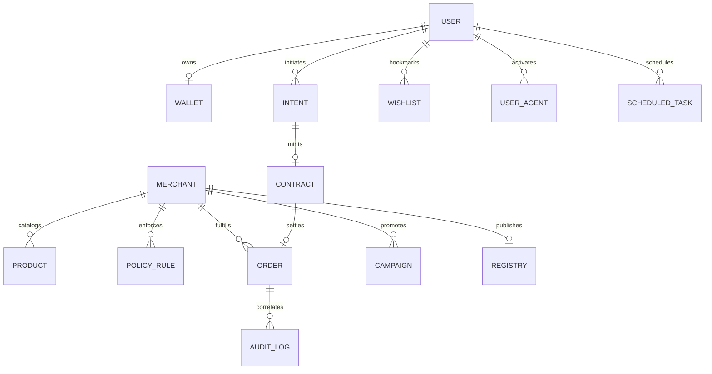

# PayGate 402 — Database Architecture & Data Dictionary

> **Complete Mongoose Schema Definitions, Indexes, Entity-Relationship Models & Encryption Hooks**

---

## 1. Entity-Relationship Model (Mermaid ERD)



---

## 2. Complete Data Dictionary (All 15 Mongoose Models)

### 1. `AuditLog` Schema (`backend/models/AuditLog.js`)
Stores immutable forensic records for every security decision and payment attempt.
- `correlationId` (String, required, indexed) — Cryptographic tracking hash.
- `agentId` (String, required) — Autonomous agent identifier.
- `merchant` (ObjectId, ref: `Merchant`) — Associated merchant.
- `mandateHash` (String, indexed) — SHA-256 digest of signed cart mandate.
- `action` (String, required) — Action name (e.g. `PAYMENT_EXECUTION`, `CONTRACT_GENERATED`).
- `decision` (String, enum: `['ALLOW', 'BLOCK', 'REQUIRE_APPROVAL', 'PAYOUT_HOLD']`).
- `reason` (String, required) — Human and machine-readable explanation.
- `ipAddress` (String, default: `127.0.0.1`) — Client IP.
- `executionTimeMs` (Number, default: 0) — Gateway execution latency in milliseconds.
- `metadata` (Mixed, default: `{}`) — Arbitrary telemetry and risk factor breakdown.

---

### 2. `Contract` Schema (`backend/models/Contract.js`)
Stores cryptographically signed AP2 Commerce Contracts.
- `contractId` (String, required, unique, trim) — Human-readable identifier (e.g. `contract_mnd_...`).
- `intent` (ObjectId, ref: `Intent`, required, indexed) — Parent intent.
- `merchant` (ObjectId, ref: `Merchant`, required) — Target merchant store.
- `agentId` (String, required) — Client agent identifier.
- `userPublicKey` (String, required) — RSA-2048 SPKI PEM public key.
- `contractTerms` (Object):
  - `items` (Array of subdocuments: `productId`, `title`, `price`, `quantity`).
  - `agreedAmount` (Number, required) — Settled total in INR.
  - `currency` (String, default: `'INR'`).
- `mandateHash` (String, required, indexed) — SHA-256 digest of cart payload.
- `userSignature` (String, required) — Base64 RSASSA-PSS SHA-256 signature.
- `expiresAt` (Date, required) — Contract expiration timestamp (default: 15 minutes).
- `status` (String, enum: `['active', 'settled', 'expired', 'revoked']`, default: `'active'`).

---

### 3. `Intent` Schema (`backend/models/Intent.js`)
Represents an agent's initial purchase intent and single-use nonce.
- `agentId` (String, required, indexed) — Calling agent ID.
- `userPublicKey` (String, required) — Buyer public key.
- `budgetCap` (Number, required, min: 0) — Maximum allowable spend limit in INR.
- `category` (String, default: `'General'`) — Product category filter.
- `query` (String, default: `''`) — Search query text.
- `nonce` (String, required, unique) — 32-byte hex CSPRNG string.
- `status` (String, enum: `['submitted', 'matched', 'contract_created', 'expired', 'rejected']`, default: `'submitted'`).

---

### 4. `Merchant` Schema (`backend/models/Merchant.js`)
Stores store identities with AES-256 encrypted credentials and KYC status.
- `businessName` (String, required, trim) — Store display name.
- `email` (String, required, unique, lowercase, trim) — Login email.
- `phone` (String, required, unique, trim) — Contact telephone.
- `password` (String, required) — Password hash.
- `businessCategory` (String, default: `'General'`) — Industry vertical.
- `razorpayKeyId` (String, default: `''`) — Razorpay API key identifier.
- `razorpayKeySecret` (String, default: `''`) — **AES-256-GCM Encrypted** API secret.
- `razorpayWebhookSecret` (String, default: `''`) — Webhook signature key.
- `kycStatus` (String, enum: `['pending', 'verified', 'rejected']`, default: `'pending'`).
- `panNumber` (String, default: `''`) — **AES-256-GCM Encrypted** PAN string.
- `gstin` (String, default: `''`) — GSTIN tax number.
- `isVerified` (Boolean, default: false) — Verification state.
- `isActive` (Boolean, default: true) — Store active flag.

---

### 5. `Wallet` Schema (`backend/models/Wallet.js`)
Internal pre-funded ledger storing user balances and audit subdocuments.
- `owner` (ObjectId, ref: `User`, required, unique) — Associated buyer account.
- `balance` (Number, required, default: 0, min: 0) — Current spendable balance in INR.
- `currency` (String, default: `'INR'`).
- `perTransactionCap` (Number, default: 10000) — Single debit ceiling in INR.
- `perDayCap` (Number, default: 50000) — Daily aggregate debit limit.
- `dailySpent` (Number, default: 0) — Cumulative spend for current calendar day.
- `lastSpentResetDate` (Date, default: Date.now) — Reset tracker for daily spent.
- `ledger` (Array of subdocuments):
  - `type` (String, enum: `['credit', 'debit', 'rollback_refund', 'topup']`, required).
  - `amount` (Number, required) — Transaction amount in INR.
  - `referenceId` (String, required) — Contract or order reference.
  - `description` (String, default: `''`) — Purpose of transaction.
  - `status` (String, enum: `['completed', 'failed', 'pending']`, default: `'completed'`).
  - `createdAt` (Date, default: Date.now).

---

### 6. `PolicyRule` Schema (`backend/models/PolicyRule.js`)
Dynamic governance rules configured by merchants.
- `merchant` (ObjectId, ref: `Merchant`, required, indexed).
- `name` (String, required, trim) — Rule title (e.g. "Max Order Cap").
- `ruleId` (String, required, trim) — Unique identifier (e.g. `RULE_SPEND_CAP_01`).
- `ruleType` (String, enum: `['max_spend_cap', 'allowed_categories', 'daily_velocity_limit', 'require_manual_approval']`).
- `maxAmount` (Number) — Spend ceiling threshold.
- `dailyCap` (Number) — Daily velocity limit.
- `allowedCategories` (Array of Strings) — Permitted category list.
- `requireApprovalThreshold` (Number) — Manual approval ceiling.
- `precedence` (Number, default: 100, indexed) — Execution priority ($1 = \text{highest}$).
- `isActive` (Boolean, default: true, indexed).

---

### 7. `Order` Schema (`backend/models/Order.js`)
Core record for fulfilled and settled purchases.
- `orderId` (String, required, unique) — Public order reference.
- `contract` (ObjectId, ref: `Contract`, required) — Associated AP2 contract.
- `merchant` (ObjectId, ref: `Merchant`, required, indexed) — Target merchant.
- `amount` (Number, required) — Settled purchase amount.
- `currency` (String, default: `'INR'`).
- `status` (String, enum: `['paid', 'gated', 'fulfilled', 'cancelled', 'refunded']`, default: `'paid'`, indexed).
- `gateDecision` (String, default: `'ALLOW'`) — Recorded checkpoint outcome.
- `items` (Array of items).
- `customer` (Object: `name`, `email`, `phone`).

---

### 8. `Product` Schema (`backend/models/Product.js`)
Merchant catalog inventory.
- `merchant` (ObjectId, ref: `Merchant`, required, indexed).
- `title` (String, required, trim).
- `description` (String, default: `''`).
- `price` (Number, required, min: 0).
- `stock` (Number, default: 100, min: 0).
- `category` (String, default: `'General'`, indexed).
- `isAvailable` (Boolean, default: true).
- `tags` (Array of Strings).

---

### 9. `Registry` Schema (`backend/models/Registry.js`)
Verified AI agents and public key registry.
- `merchant` (ObjectId, ref: `Merchant`, required, unique).
- `slug` (String, required, unique, lowercase, trim).
- `displayName` (String, required, trim).
- `category` (String, default: `'General'`, indexed).
- `trustScore` (Number, default: 85, min: 0, max: 100).
- `supportedProtocols` (Array of Strings, default: `['AP2/CartMandate', 'x402/BaseRPC']`).
- `isListed` (Boolean, default: true, indexed).

---

### 10. `User` Schema (`backend/models/User.js`)
Buyer user profile and auth.
- `name` (String, required, trim).
- `email` (String, required, unique, lowercase, trim).
- `password` (String, required) — PBKDF2 salt-hashed password.
- `phone` (String, default: `''`).
- `walletId` (ObjectId, ref: `Wallet`).
- `role` (String, enum: `['user', 'admin']`, default: `'user'`).

---

### 11. Additional Auxiliary Models
- **`Negotiation` (`models/Negotiation.js`):** Tracks multi-round counter-offers between agents and merchants.
- **`ScheduledTask` (`models/ScheduledTask.js`):** Stores automated cron-driven agent purchases ("buy at 6 PM").
- **`UserAgent` (`models/UserAgent.js`):** Association table linking buyers with enabled agent capabilities.
- **`Wishlist` (`models/Wishlist.js`):** Saved items from internal catalog with unique compound index `{ user: 1, product: 1 }`.
- **`Campaign` (`models/Campaign.js`):** Promotional volume discounts with minimum quantity tiers.

---

## 3. Schema Lifecycle Hooks & Pre-Save Encryption

The `Merchant` schema applies automatic AES-256-GCM encryption on modified secrets:

```javascript
// backend/models/Merchant.js
merchantSchema.pre('save', function (next) {
  if (this.isModified('razorpayKeySecret') && this.razorpayKeySecret && !this.razorpayKeySecret.includes(':')) {
    this.razorpayKeySecret = encryptText(this.razorpayKeySecret);
  }
  if (this.isModified('panNumber') && this.panNumber && !this.panNumber.includes(':')) {
    this.panNumber = encryptText(this.panNumber);
  }
  next();
});
```
